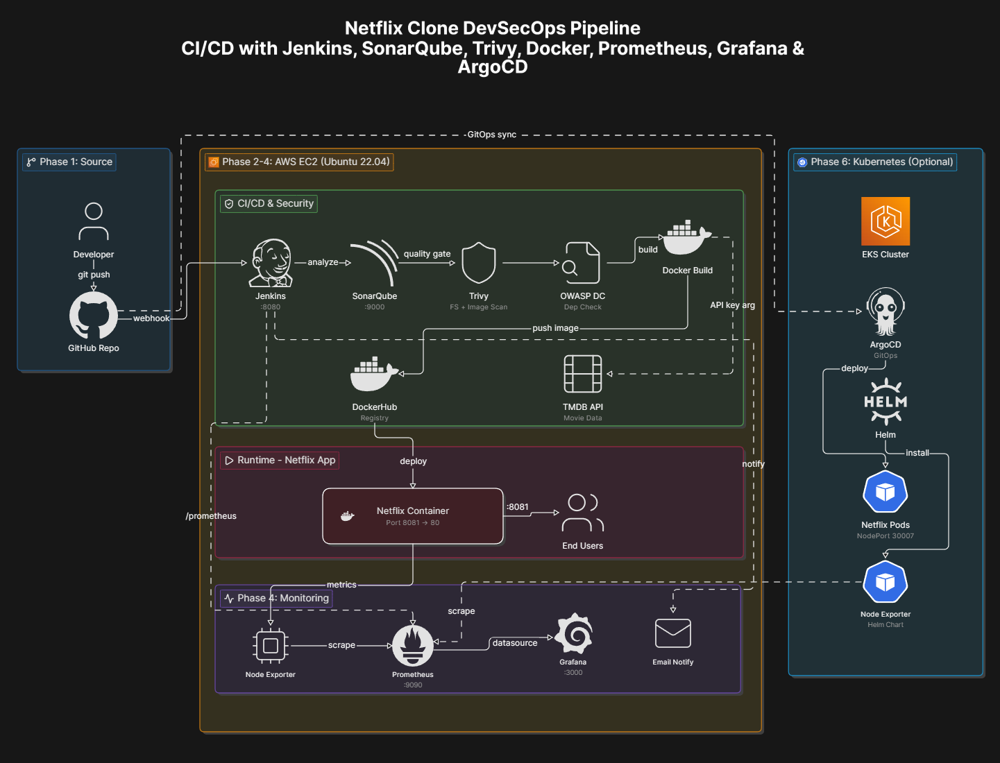
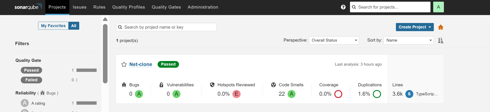
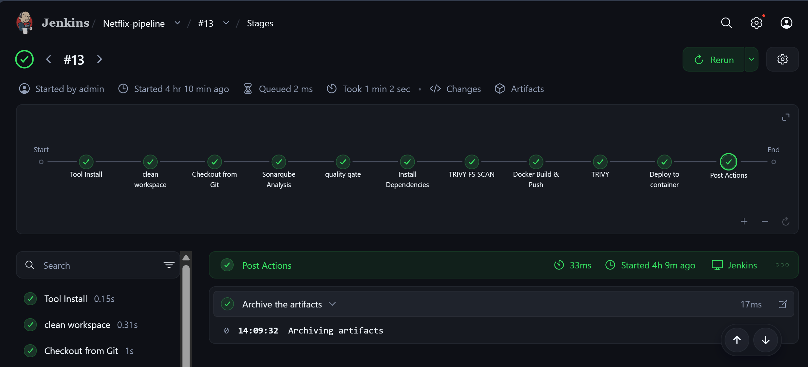
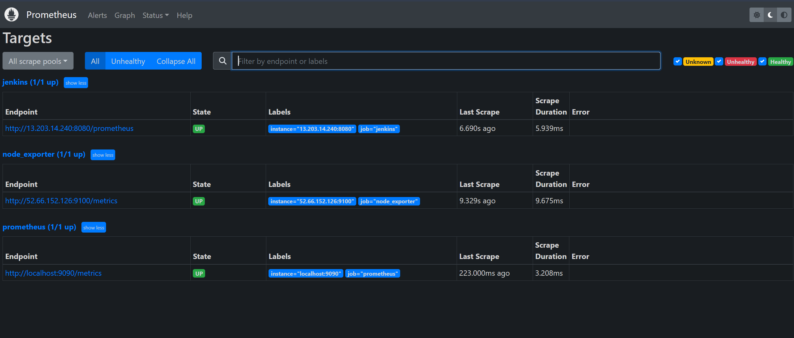
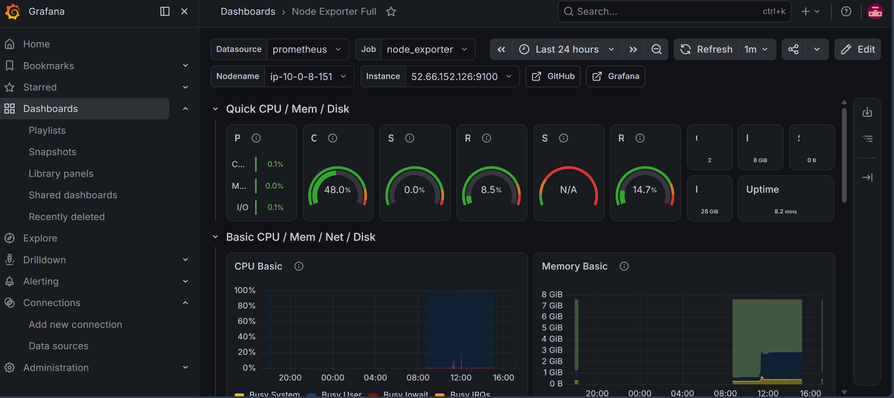

# DevSecOps Project: Netflix Clone Deployment with Jenkins, SonarQube, Prometheus, and Grafana

<div align="center">
  
  <p align="center">Architecture Diagram</p>
</div>

<div align="center">
  <br>
  <a href="http://netflix-clone-with-tmdb-using-react-mui.vercel.app/">
    
  </a>
</div>
<br />

<div align="center">
  
  <p align="center">Home Page</p>
</div>


# Deploy Netflix Clone on Cloud using Jenkins - DevSecOps Project!

### **Phase 1: Initial Setup and Deployment**

**Step 1: Launch EC2 (Ubuntu 22.04 LTS):**

- Provision an EC2 instance on AWS with Ubuntu 26.04 LTS.
- Connect to the instance using SSH.

> **🔒 Security Best Practices for EC2 Instance:**
>
> - **Configure Security Groups Mindfully:** Restrict inbound traffic to only the ports required for the application (e.g., port 8081 for the Netflix clone, port 9000 for SonarQube, port 8080 for Jenkins). Avoid opening all ports (`0.0.0.0/0`) unless absolutely necessary.
> - **Allow Only Trusted IPs for Internal Ports:** Limit SSH access (port 22) and internal service ports to your own IP address or a trusted set of IPs (e.g., your office/home VPN). Use your public IP (`<your-ip>/32`) in the inbound rules instead of open ranges.
> - **Disable Password Authentication:** Use SSH key pairs for authentication instead of passwords to prevent brute-force attacks.
> - **Keep the OS and Packages Updated:** Regularly run `sudo apt update && sudo apt upgrade` to patch known vulnerabilities.
> - **Enable AWS CloudTrail and VPC Flow Logs:** Monitor API calls and network traffic for suspicious activity.

**Step 2: Clone the Code:**

- Update all the packages and then clone the code.
- Clone your application's code repository onto the EC2 instance:
    
    ```bash
    git clone https://github.com/JimilPrabtani/DevSecOps-Project.git
    ```
    

**Step 3: Install Docker and Run the App Using a Container:**

- Set up Docker on the EC2 instance:
    
    ```bash
    sudo apt-get update
    sudo apt-get install docker.io -y
    sudo usermod -aG docker $USER  # Replace with your system's username, e.g., 'ubuntu'
    newgrp docker
    sudo chmod 777 /var/run/docker.sock
    ```
    
- Build and run your application using Docker containers:
    
    ```bash
    docker build -t netflix .
    docker run -d --name netflix -p 8081:80 netflix:latest
    
    #to delete
    docker stop <containerid>
    docker rmi -f netflix
    ```

It will show an error cause you need API key

**Step 4: Get the API Key:**

- Open a web browser and navigate to TMDB (The Movie Database) website.
- Click on "Login" and create an account.
- Once logged in, go to your profile and select "Settings."
- Click on "API" from the left-side panel.
- Create a new API key by clicking "Create" and accepting the terms and conditions.
- Provide the required basic details and click "Submit."
- You will receive your TMDB API key.

Now recreate the Docker image with your api key:
```
docker build --build-arg TMDB_V3_API_KEY=<your-api-key> -t netflix .
```

**Phase 2: Security**

1. **Install SonarQube and Trivy:**
    - Install SonarQube and Trivy on the EC2 instance to scan for vulnerabilities.
        
        sonarqube
        ```
        docker run -d --name sonar -p 9000:9000 sonarqube:lts-community
        ```    
        To access: 
        
        publicIP:9000 (by default username & password is admin)

    <div align="center">
    
    </div>


        
        To install Trivy:
        ```
        sudo apt-get install wget gnupg
        wget -qO - https://aquasecurity.github.io/trivy-repo/deb/public.key | gpg --dearmor | sudo tee /usr/share/keyrings/trivy.gpg > /dev/null
        echo "deb [signed-by=/usr/share/keyrings/trivy.gpg] https://aquasecurity.github.io/trivy-repo/deb generic main" | sudo tee -a /etc/apt/sources.list.d/trivy.list
        sudo apt-get update
        sudo apt-get install trivy        
        ```
        
        to scan image using trivy
        ```
        trivy image <imageid>
        ```
        
        
2. **Integrate SonarQube and Configure:**
    - Integrate SonarQube with your CI/CD pipeline.
    - Configure SonarQube to analyze code for quality and security issues.

**Phase 3: CI/CD Setup**

1. **Install Jenkins for Automation:**
   
    <div align="center">
    
    </div>
    - Install Jenkins on the EC2 instance to automate deployment:
    Install Java
    
    ```bash
    sudo apt update
    sudo apt install fontconfig openjdk-17-jre
    java -version
    openjdk version "17.0.11" 2024-04-16
    OpenJDK Runtime Environment (build 17.0.11+9-Ubuntu-122.04)
    OpenJDK 64-Bit Server VM (build 17.0.11+9-Ubuntu-122.04, mixed mode, sharing)
    
    #jenkins
    sudo wget -O /usr/share/keyrings/jenkins-keyring.asc \
    https://pkg.jenkins.io/debian-stable/jenkins.io-2023.key
    echo deb [signed-by=/usr/share/keyrings/jenkins-keyring.asc] \
    https://pkg.jenkins.io/debian-stable binary/ | sudo tee \
    /etc/apt/sources.list.d/jenkins.list > /dev/null
    sudo apt-get update
    sudo apt-get install jenkins
    sudo systemctl start jenkins
    sudo systemctl enable jenkins
    ```
    
    - Access Jenkins in a web browser using the public IP of your EC2 instance.
        
        publicIp:8080
        
2. **Install Necessary Plugins in Jenkins:**

Goto Manage Jenkins →Plugins → Available Plugins →

Install below plugins

1 Eclipse Temurin Installer (Install without restart)

2 SonarQube Scanner (Install without restart)

3 NodeJs Plugin (Install Without restart)

4 Email Extension Plugin

### **Configure Java and Nodejs in Global Tool Configuration**

Goto Manage Jenkins → Tools → Install JDK(17) and NodeJs(20)→ Click on Apply and Save


### SonarQube

Create the token

Goto Jenkins Dashboard → Manage Jenkins → Credentials → Add Secret Text. It should look like this

After adding sonar token

Click on Apply and Save

**The Configure System option** is used in Jenkins to configure different server

**Global Tool Configuration** is used to configure different tools that we install using Plugins

We will install a sonar scanner in the tools.

Create a Jenkins webhook

1. **Configure CI/CD Pipeline in Jenkins:**
- Create a CI/CD pipeline in Jenkins to automate your application deployment.

```groovy
pipeline {
    agent any
    tools {
        jdk 'jdk17'
        nodejs 'node20'
    }
    environment {
        SCANNER_HOME = tool 'sonar-scanner'
    }
    stages {
        stage('clean workspace') {
            steps {
                cleanWs()
            }
        }
        stage('Checkout from Git') {
            steps {
                git branch: 'main', url: 'https://github.com/JimilPrabtani/DevSecOps-Project.git'
            }
        }
        stage("Sonarqube Analysis") {
            steps {
                withSonarQubeEnv('sonar-server') {
                    sh '''$SCANNER_HOME/bin/sonar-scanner -Dsonar.projectName=Netflix \
                    -Dsonar.projectKey=Netflix'''
                }
            }
        }
        stage("quality gate") {
            steps {
                script {
                    waitForQualityGate abortPipeline: false, credentialsId: 'Sonar-token'
                }
            }
        }
        stage('Install Dependencies') {
            steps {
                sh "npm install"
            }
        }
    }
}
```

Certainly, here are the instructions without step numbers:

**Install Dependency-Check and Docker Tools in Jenkins**

**Install Dependency-Check Plugin:**

- Go to "Dashboard" in your Jenkins web interface.
- Navigate to "Manage Jenkins" → "Manage Plugins."
- Click on the "Available" tab and search for "OWASP Dependency-Check."
- Check the checkbox for "OWASP Dependency-Check" and click on the "Install without restart" button.

**Configure Dependency-Check Tool (optional, I have not done it because it take too long to install the NVD database through API key):**

- After installing the Dependency-Check plugin, you need to configure the tool.
- Go to "Dashboard" → "Manage Jenkins" → "Global Tool Configuration."
- Find the section for "OWASP Dependency-Check."
- Add the tool's name, e.g., "DP-Check."
- Save your settings.

**Install Docker Tools and Docker Plugins:**

- Go to "Dashboard" in your Jenkins web interface.
- Navigate to "Manage Jenkins" → "Manage Plugins."
- Click on the "Available" tab and search for "Docker."
- Check the following Docker-related plugins:
  - Docker
  - Docker Commons
  - Docker Pipeline
  - Docker API
  - docker-build-step
- Click on the "Install without restart" button to install these plugins.

**Add DockerHub Credentials:**

- To securely handle DockerHub credentials in your Jenkins pipeline, follow these steps:
  - Go to "Dashboard" → "Manage Jenkins" → "Manage Credentials."
  - Click on "System" and then "Global credentials (unrestricted)."
  - Click on "Add Credentials" on the left side.
  - Choose "Secret text" as the kind of credentials.
  - Enter your DockerHub credentials (Username and Password) and give the credentials an ID (e.g., "docker").
  - Click "OK" to save your DockerHub credentials.

Now, you have installed the Dependency-Check plugin, configured the tool, and added Docker-related plugins along with your DockerHub credentials in Jenkins. You can now proceed with configuring your Jenkins pipeline to include these tools and credentials in your CI/CD process.

```groovy

pipeline {
    agent any
    tools {
        jdk 'jdk17'
        nodejs 'node20'
    }
    options {
        timestamps()
    }
    environment {
        SCANNER_HOME = tool 'sonar-scanner'
        IMAGE_NAME = 'buddy009/netflix'
    }
    stages {
        stage('clean workspace') {
            steps { cleanWs() }
        }

        stage('Checkout from Git') {
            steps {
                git branch: 'main', url: 'https://github.com/JimilPrabtani/DevSecOps-Project.git'
            }
        }

        stage('Sonarqube Analysis') {
            steps {
                withSonarQubeEnv(credentialsId: 'sonar-token', installationName: 'sonar-server') {
                    sh '''
                      $SCANNER_HOME/bin/sonar-scanner \
                      -Dsonar.projectName=Netflix \
                      -Dsonar.projectKey=Netflix
                    '''
                }
            }
        }

        stage('quality gate') {
            steps {
                timeout(time: 15, unit: 'MINUTES') {
                    waitForQualityGate abortPipeline: true
                }
            }
        }

        stage('Install Dependencies') {
            steps {
                sh 'npm ci'
                sh 'npm -v'
                sh 'node -v'
            }
        }

        stage('TRIVY FS SCAN') {
            steps {
                sh 'trivy fs --scanners vuln,secret . | tee trivyfs.txt'
            }
        }

        stage('Docker Build & Push') {
            steps {
                withCredentials([
                    usernamePassword(credentialsId: 'docker', usernameVariable: 'DOCKER_USER', passwordVariable: 'DOCKER_PASS'),
                    string(credentialsId: 'tmdb-v3-api-key', variable: 'TMDB_V3_API_KEY')
                ]) {
                    sh '''
                      echo "$DOCKER_PASS" | docker login -u "$DOCKER_USER" --password-stdin
                      docker build --build-arg TMDB_V3_API_KEY=$TMDB_V3_API_KEY -t netflix .
                      docker tag netflix ${IMAGE_NAME}:latest
                      docker push ${IMAGE_NAME}:latest
                    '''
                }
            }
        }

        stage('TRIVY') {
            steps {
                sh 'trivy image ${IMAGE_NAME}:latest | tee trivyimage.txt'
            }
        }

        stage('Deploy to container') {
            steps {
                sh '''
                  docker rm -f netflix || true
                  docker run -d --name netflix -p 8081:80 ${IMAGE_NAME}:latest
                '''
            }
        }
    }

    post {
        always {
            archiveArtifacts artifacts: 'trivyfs.txt,trivyimage.txt', allowEmptyArchive: true
        }
    }
}


//
If you get docker login failed errorr

sudo su
sudo usermod -aG docker jenkins
sudo systemctl restart jenkins
//
```

**Phase 4: Monitoring**

1. **Install Prometheus and Grafana:**

   Set up Prometheus and Grafana to monitor your application.

   **Installing Prometheus:**

   First, create a dedicated Linux user for Prometheus and download Prometheus:

   ```bash
   sudo useradd --system --no-create-home --shell /bin/false prometheus
   wget https://github.com/prometheus/prometheus/releases/download/v2.53.0/prometheus-2.53.0.linux-amd64.tar.gz
   ```

   Extract Prometheus files, move them, and create directories:

   ```bash
   tar -xvf prometheus-2.53.0.linux-amd64.tar.gz
   cd prometheus-2.53.0.linux-amd64/
   sudo mkdir -p /data /etc/prometheus
   sudo mv prometheus promtool /usr/local/bin/
   sudo mv consoles/ console_libraries/ /etc/prometheus/
   sudo mv prometheus.yml /etc/prometheus/prometheus.yml
   ```

    <div align="center">
    
    </div>

   Set ownership for directories:

   ```bash
   sudo chown -R prometheus:prometheus /etc/prometheus/ /data/
   ```

   Create a systemd unit configuration file for Prometheus:

   ```bash
   sudo nano /etc/systemd/system/prometheus.service
   ```

   Add the following content to the `prometheus.service` file:

   ```plaintext
   [Unit]
   Description=Prometheus
   Wants=network-online.target
   After=network-online.target

   StartLimitIntervalSec=500
   StartLimitBurst=5

   [Service]
   User=prometheus
   Group=prometheus
   Type=simple
   Restart=on-failure
   RestartSec=5s
   ExecStart=/usr/local/bin/prometheus \
     --config.file=/etc/prometheus/prometheus.yml \
     --storage.tsdb.path=/data \
     --web.console.templates=/etc/prometheus/consoles \
     --web.console.libraries=/etc/prometheus/console_libraries \
     --web.listen-address=0.0.0.0:9090 \
     --web.enable-lifecycle

   [Install]
   WantedBy=multi-user.target
   ```

   Here's a brief explanation of the key parts in this `prometheus.service` file:

   - `User` and `Group` specify the Linux user and group under which Prometheus will run.

   - `ExecStart` is where you specify the Prometheus binary path, the location of the configuration file (`prometheus.yml`), the storage directory, and other settings.

   - `web.listen-address` configures Prometheus to listen on all network interfaces on port 9090.

   - `web.enable-lifecycle` allows for management of Prometheus through API calls.

   Enable and start Prometheus:

   ```bash
   sudo systemctl enable prometheus
   sudo systemctl start prometheus
   ```

   Verify Prometheus's status:

   ```bash
   sudo systemctl status prometheus
   ```

   You can access Prometheus in a web browser using your server's IP and port 9090:

   `http://<your-server-ip>:9090`

   **Installing Node Exporter:**

   Create a system user for Node Exporter and download Node Exporter:

   ```bash
   sudo useradd --system --no-create-home --shell /bin/false node_exporter
   wget https://github.com/prometheus/node_exporter/releases/download/v1.8.1/node_exporter-1.8.1.linux-amd64.tar.gz
   ```

   Extract Node Exporter files, move the binary, and clean up:

   ```bash
   tar -xvf node_exporter-1.8.1.linux-amd64.tar.gz
   sudo mv node_exporter-1.8.1.linux-amd64/node_exporter /usr/local/bin/
   rm -rf node_exporter*
   ```

   Create a systemd unit configuration file for Node Exporter:

   ```bash
   sudo nano /etc/systemd/system/node_exporter.service
   ```

   Add the following content to the `node_exporter.service` file:

   ```plaintext
   [Unit]
   Description=Node Exporter
   Wants=network-online.target
   After=network-online.target

   StartLimitIntervalSec=500
   StartLimitBurst=5

   [Service]
   User=node_exporter
   Group=node_exporter
   Type=simple
   Restart=on-failure
   RestartSec=5s
   ExecStart=/usr/local/bin/node_exporter --collector.logind

   [Install]
   WantedBy=multi-user.target
   ```

   Replace `--collector.logind` with any additional flags as needed.

   Enable and start Node Exporter:

   ```bash
   sudo systemctl enable node_exporter
   sudo systemctl start node_exporter
   ```

   Verify the Node Exporter's status:

   ```bash
   sudo systemctl status node_exporter
   ```

   You can access Node Exporter metrics in Prometheus.

2. **Configure Prometheus Plugin Integration:**

   Integrate Jenkins with Prometheus to monitor the CI/CD pipeline.

   **Prometheus Configuration:**

   To configure Prometheus to scrape metrics from Node Exporter and Jenkins, you need to modify the `prometheus.yml` file. Here is an example `prometheus.yml` configuration for your setup:

   ```yaml
   global:
     scrape_interval: 15s

   scrape_configs:
     - job_name: 'node_exporter'
       static_configs:
         - targets: ['localhost:9100']

     - job_name: 'jenkins'
       metrics_path: '/prometheus'
       static_configs:
         - targets: ['<your-jenkins-ip>:<your-jenkins-port>']
   ```

   Make sure to replace `<your-jenkins-ip>` and `<your-jenkins-port>` with the appropriate values for your Jenkins setup.

   Check the validity of the configuration file:

   ```bash
   promtool check config /etc/prometheus/prometheus.yml
   ```

   Reload the Prometheus configuration without restarting:

   ```bash
   curl -X POST http://localhost:9090/-/reload
   ```

   You can access Prometheus targets at:

   `http://<your-prometheus-ip>:9090/targets`


####Grafana

**Install Grafana on Ubuntu 22.04 and Set it up to Work with Prometheus**

**Step 1: Install Dependencies:**

First, ensure that all necessary dependencies are installed:

```bash
sudo apt-get update
sudo apt-get install -y apt-transport-https software-properties-common
```

**Step 2: Install Grafana:**

```
sudo apt-get install -y adduser libfontconfig1 musl
wget https://dl.grafana.com/grafana-enterprise/release/13.1.0/grafana-enterprise_13.1.0_28013217238_linux_amd64.deb
sudo dpkg -i grafana-enterprise_13.1.0_28013217238_linux_amd64.deb
```

<div align="center">

</div>


**Step 3: Enable and Start Grafana Service:**

To automatically start Grafana after a reboot, enable the service:

```bash
sudo systemctl enable grafana-server
```

Then, start Grafana:

```bash
sudo systemctl start grafana-server
```

**Step 4: Check Grafana Status:**

Verify the status of the Grafana service to ensure it's running correctly:

```bash
sudo systemctl status grafana-server
```

**Step 5: Access Grafana Web Interface:**

Open a web browser and navigate to Grafana using your server's IP address. The default port for Grafana is 3000. For example:

`http://<your-server-ip>:3000`

You'll be prompted to log in to Grafana. The default username is "admin," and the default password is also "admin."

**Step 6: Change the Default Password:**

When you log in for the first time, Grafana will prompt you to change the default password for security reasons. Follow the prompts to set a new password.

**Step 7: Add Prometheus Data Source:**

To visualize metrics, you need to add a data source. Follow these steps:

- Click on the gear icon (⚙️) in the left sidebar to open the "Configuration" menu.

- Select "Data Sources."

- Click on the "Add data source" button.

- Choose "Prometheus" as the data source type.

- In the "HTTP" section:
  - Set the "URL" to `http://localhost:9090` (assuming Prometheus is running on the same server).
  - Click the "Save & Test" button to ensure the data source is working.

**Step 8: Import a Dashboard:**

To make it easier to view metrics, you can import a pre-configured dashboard. Follow these steps:

- Click on the "+" (plus) icon in the left sidebar to open the "Create" menu.

- Select "Dashboard."

- Click on the "Import" dashboard option.

- Enter the dashboard code you want to import (e.g., code 1860).

- Click the "Load" button.

- Select the data source you added (Prometheus) from the dropdown.

- Click on the "Import" button.

You should now have a Grafana dashboard set up to visualize metrics from Prometheus.

Grafana is a powerful tool for creating visualizations and dashboards, and you can further customize it to suit your specific monitoring needs.

That's it! You've successfully installed and set up Grafana to work with Prometheus for monitoring and visualization.

1. **Configure Prometheus Plugin Integration:**
    - Integrate Jenkins with Prometheus to monitor the CI/CD pipeline.


**Phase 5: Notification**

1. **Implement Notification Services:**
    - Set up email notifications in Jenkins or other notification mechanisms.

# Phase 6: Kubernetes (Optional)
## This part will cost you money so if you want to skip this part you can skip it.
## Create Kubernetes Cluster with Nodegroups

In this phase, you'll set up a Kubernetes cluster with node groups. This will provide a scalable environment to deploy and manage your applications.

## Monitor Kubernetes with Prometheus

Prometheus is a powerful monitoring and alerting toolkit, and you'll use it to monitor your Kubernetes cluster. Additionally, you'll install the node exporter using Helm to collect metrics from your cluster nodes.

### Install Node Exporter using Helm

To begin monitoring your Kubernetes cluster, you'll install the Prometheus Node Exporter. This component allows you to collect system-level metrics from your cluster nodes. Here are the steps to install the Node Exporter using Helm:

1. Add the Prometheus Community Helm repository:

    ```bash
    helm repo add prometheus-community https://prometheus-community.github.io/helm-charts
    ```

2. Create a Kubernetes namespace for the Node Exporter:

    ```bash
    kubectl create namespace prometheus-node-exporter
    ```

3. Install the Node Exporter using Helm:

    ```bash
    helm install prometheus-node-exporter prometheus-community/prometheus-node-exporter --namespace prometheus-node-exporter
    ```

Add a Job to Scrape Metrics on nodeip:9001/metrics in prometheus.yml:

Update your Prometheus configuration (prometheus.yml) to add a new job for scraping metrics from nodeip:9001/metrics. You can do this by adding the following configuration to your prometheus.yml file:


```
  - job_name: 'Netflix'
    metrics_path: '/metrics'
    static_configs:
      - targets: ['node1Ip:9100']
```

Replace 'your-job-name' with a descriptive name for your job. The static_configs section specifies the targets to scrape metrics from, and in this case, it's set to nodeip:9001.

Don't forget to reload or restart Prometheus to apply these changes to your configuration.

To deploy an application with ArgoCD, you can follow these steps, which I'll outline in Markdown format:

### Deploy Application with ArgoCD

1. **Install ArgoCD:**

   You can install ArgoCD on your Kubernetes cluster by following the instructions provided in the [EKS Workshop](https://archive.eksworkshop.com/intermediate/290_argocd/install/) documentation.

2. **Set Your GitHub Repository as a Source:**

   After installing ArgoCD, you need to set up your GitHub repository as a source for your application deployment. This typically involves configuring the connection to your repository and defining the source for your ArgoCD application. The specific steps will depend on your setup and requirements.

3. **Create an ArgoCD Application:**
   - `name`: Set the name for your application.
   - `destination`: Define the destination where your application should be deployed.
   - `project`: Specify the project the application belongs to.
   - `source`: Set the source of your application, including the GitHub repository URL, revision, and the path to the application within the repository.
   - `syncPolicy`: Configure the sync policy, including automatic syncing, pruning, and self-healing.

4. **Access your Application**
   - To Access the app make sure port 30007 is open in your security group and then open a new tab paste your NodeIP:30007, your app should be running.

**Phase 7: Cleanup**

1. **Cleanup AWS EC2 Instances:**
    - Terminate AWS EC2 instances that are no longer needed.
